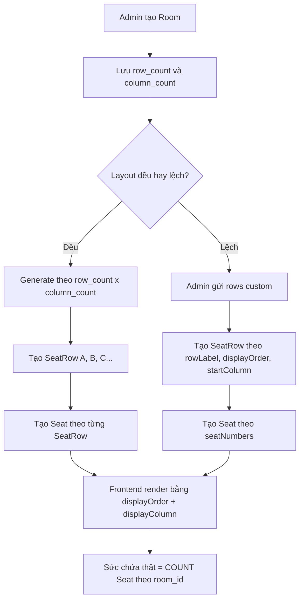
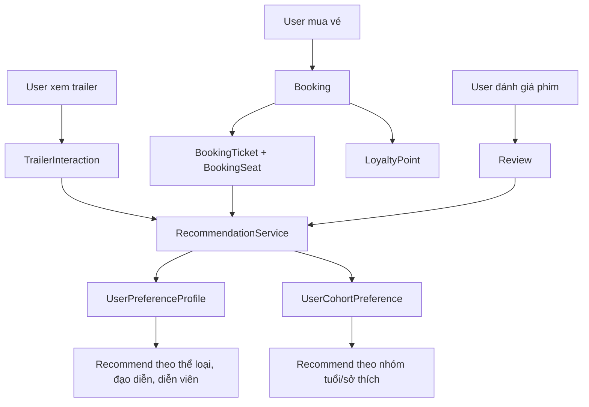

# Conceptual Model - CinemaAI

File này mô tả conceptual model của backend CinemaAI theo Mermaid. Mô hình được gom theo các domain chính: user, phim, rạp, phòng chiếu, hàng ghế, ghế, suất chiếu, booking, payment, promotion, point và recommendation.

## ERD

```mermaid
erDiagram
    USER {
        bigint id PK
        string email
        string full_name
        string phone
        string status
    }

    USER_PROFILE {
        bigint id PK
        bigint user_id FK
        date date_of_birth
        string gender
        string address
    }

    ROLE {
        bigint id PK
        string name
    }

    USER_ROLE {
        bigint id PK
        bigint user_id FK
        bigint role_id FK
    }

    CINEMA {
        bigint id PK
        string name
        string address
        string city
        string phone
        string status
    }

    ROOM {
        bigint id PK
        bigint cinema_id FK
        string name
        string room_type
        int row_count
        int column_count
        string status
    }

    SEAT_ROW {
        bigint id PK
        bigint room_id FK
        string row_label
        int display_order
        int start_column
        string row_type
    }

    SEAT {
        bigint id PK
        bigint room_id FK
        bigint seat_row_id FK
        string row_label
        int seat_number
        int display_column
        string seat_type
        string status
    }

    MOVIE {
        bigint id PK
        string title
        int duration_minutes
        string status
        string age_rating
        string director
        string description
        string trailer_url
        string poster_url
    }

    GENRE {
        bigint id PK
        string name
        string description
    }

    ACTOR {
        bigint id PK
        string name
        string biography
    }

    MOVIE_GENRE {
        bigint id PK
        bigint movie_id FK
        bigint genre_id FK
    }

    MOVIE_ACTOR {
        bigint id PK
        bigint movie_id FK
        bigint actor_id FK
        string character_name
    }

    SHOWTIME {
        bigint id PK
        bigint movie_id FK
        bigint room_id FK
        datetime start_time
        datetime end_time
        decimal base_price
        string status
    }

    BOOKING {
        bigint id PK
        bigint user_id FK
        bigint showtime_id FK
        string booking_code
        string status
        decimal total_amount
        datetime hold_expires_at
        datetime paid_at
        datetime checked_in_at
        datetime refund_requested_at
        datetime refunded_at
    }

    BOOKING_SEAT {
        bigint id PK
        bigint booking_id FK
        bigint showtime_id FK
        bigint seat_id FK
        decimal unit_price
        string status
    }

    BOOKING_TICKET {
        bigint id PK
        bigint booking_id FK
        string ticket_type
        int viewer_age
        int quantity
        decimal unit_price
        decimal line_total
    }

    FOOD_ITEM {
        bigint id PK
        string name
        decimal price
        string status
    }

    FOOD_COMBO {
        bigint id PK
        string name
        decimal price
        string status
    }

    BOOKING_FOOD_ITEM {
        bigint id PK
        bigint booking_id FK
        bigint food_item_id FK
        bigint food_combo_id FK
        int quantity
        decimal unit_price
    }

    PAYMENT {
        bigint id PK
        bigint booking_id FK
        string provider
        string status
        decimal amount
        string transaction_ref
    }

    PROMOTION {
        bigint id PK
        string code
        string type
        decimal discount_value
        int required_points
        string status
    }

    BOOKING_PROMOTION {
        bigint id PK
        bigint booking_id FK
        bigint promotion_id FK
        decimal discount_amount
    }

    LOYALTY_POINT {
        bigint id PK
        bigint user_id FK
        bigint booking_id FK
        int points
        string type
        string reason
    }

    REVIEW {
        bigint id PK
        bigint user_id FK
        bigint movie_id FK
        bigint booking_id FK
        int rating
        string comment
        string status
    }

    WISHLIST {
        bigint id PK
        bigint user_id FK
        bigint movie_id FK
    }

    TRAILER_INTERACTION {
        bigint id PK
        bigint user_id FK
        bigint movie_id FK
        string interaction_type
        int watch_seconds
        int trailer_duration_seconds
    }

    USER_PREFERENCE_PROFILE {
        bigint id PK
        bigint user_id FK
        string preferred_genres
        string preferred_actors
        string preferred_directors
        string preferred_age_group
    }

    USER_COHORT_PREFERENCE {
        bigint id PK
        string cohort_key
        string preferred_genres
        string preferred_actors
    }

    AI_ANALYSIS {
        bigint id PK
        bigint movie_id FK
        bigint approved_by_user_id FK
        string status
        string summary
    }

    AI_EMOTION_SEGMENT {
        bigint id PK
        bigint analysis_id FK
        string emotion_type
        int start_second
        int end_second
    }

    NOTIFICATION {
        bigint id PK
        bigint user_id FK
        string type
        string title
        string message
        boolean read
    }

    STAFF_PROFILE {
        bigint id PK
        bigint user_id FK
        bigint cinema_id FK
        string status
    }

    STAFF_SHIFT {
        bigint id PK
        bigint staff_profile_id FK
        datetime start_time
        datetime end_time
    }

    USER ||--|| USER_PROFILE : "có hồ sơ"
    USER ||--o{ USER_ROLE : "được gán"
    ROLE ||--o{ USER_ROLE : "phân quyền"
    USER ||--o{ STAFF_PROFILE : "có thể là nhân viên"
    CINEMA ||--o{ STAFF_PROFILE : "quản lý nhân viên"
    STAFF_PROFILE ||--o{ STAFF_SHIFT : "có ca làm"

    CINEMA ||--o{ ROOM : "có phòng"
    ROOM ||--o{ SEAT_ROW : "có hàng ghế"
    SEAT_ROW ||--o{ SEAT : "có ghế"
    ROOM ||--o{ SHOWTIME : "có suất chiếu"
    MOVIE ||--o{ SHOWTIME : "được chiếu"

    MOVIE ||--o{ MOVIE_GENRE : "thuộc thể loại"
    GENRE ||--o{ MOVIE_GENRE : "gắn với phim"
    MOVIE ||--o{ MOVIE_ACTOR : "có diễn viên"
    ACTOR ||--o{ MOVIE_ACTOR : "tham gia phim"

    USER ||--o{ BOOKING : "đặt vé"
    SHOWTIME ||--o{ BOOKING : "được đặt"
    BOOKING ||--o{ BOOKING_SEAT : "giữ/mua ghế"
    SHOWTIME ||--o{ BOOKING_SEAT : "ghế theo suất"
    SEAT ||--o{ BOOKING_SEAT : "được chọn"
    BOOKING ||--o{ BOOKING_TICKET : "có loại vé"

    BOOKING ||--o{ BOOKING_FOOD_ITEM : "mua F&B"
    FOOD_ITEM ||--o{ BOOKING_FOOD_ITEM : "được mua lẻ"
    FOOD_COMBO ||--o{ BOOKING_FOOD_ITEM : "được mua combo"
    BOOKING ||--o{ PAYMENT : "thanh toán"

    BOOKING ||--o{ BOOKING_PROMOTION : "áp mã"
    PROMOTION ||--o{ BOOKING_PROMOTION : "được dùng"
    USER ||--o{ LOYALTY_POINT : "tích/đổi điểm"
    BOOKING ||--o{ LOYALTY_POINT : "phát sinh điểm"

    USER ||--o{ REVIEW : "đánh giá"
    MOVIE ||--o{ REVIEW : "được đánh giá"
    BOOKING ||--o{ REVIEW : "xác thực đã xem"
    USER ||--o{ WISHLIST : "lưu phim"
    MOVIE ||--o{ WISHLIST : "được lưu"

    USER ||--o{ TRAILER_INTERACTION : "xem trailer"
    MOVIE ||--o{ TRAILER_INTERACTION : "có tương tác"
    USER ||--|| USER_PREFERENCE_PROFILE : "hồ sơ sở thích AI"
    MOVIE ||--o{ AI_ANALYSIS : "được AI phân tích"
    USER ||--o{ AI_ANALYSIS : "duyệt kết quả"
    AI_ANALYSIS ||--o{ AI_EMOTION_SEGMENT : "có đoạn cảm xúc"
    USER ||--o{ NOTIFICATION : "nhận thông báo"
```



## Flow tạo phòng và ghế



## Rule lưu layout ghế lệch

- `ROOM.row_count`: số hàng thiết kế.
- `ROOM.column_count`: số cột hiển thị tối đa.
- `SEAT_ROW.row_label`: nhãn hàng, ví dụ `A`, `B`, `D`, `O`.
- `SEAT_ROW.display_order`: thứ tự render hàng từ trên xuống dưới.
- `SEAT_ROW.start_column`: cột bắt đầu của hàng, dùng khi hàng bị lệch trái/phải.
- `SEAT_ROW.row_type`: loại mặc định của hàng, ví dụ `STANDARD`, `VIP`, `COUPLE`.
- `SEAT.seat_row_id`: ghế thuộc hàng nào.
- `SEAT.row_label`: copy từ `SEAT_ROW.row_label` để giữ query cũ.
- `SEAT.seat_number`: số ghế user nhìn thấy.
- `SEAT.display_column`: cột render thực tế của ghế.
- Sức chứa thật không tính bằng `row_count * column_count`; phải tính bằng số record trong `SEAT`.

Ví dụ hàng A lệch vào cột 2:

```text
Cột: 01 02 03 04 05 ... 19
A:   __ A18 A17 A16 A15 ... A01
B:   __ B17 B16 B15 B14 ... B01
D:   D19 D18 D17 D16 D15 ... D01
```

Request generate custom:

```json
{
  "defaultSeatType": "STANDARD",
  "rows": [
    {
      "rowLabel": "A",
      "displayOrder": 1,
      "startColumn": 2,
      "seatType": "STANDARD",
      "seatNumbers": [18, 17, 16, 15, 14, 13, 12, 11, 10, 9, 8, 7, 6, 5, 4, 3, 2, 1]
    },
    {
      "rowLabel": "D",
      "displayOrder": 4,
      "startColumn": 1,
      "seatType": "STANDARD",
      "seatNumbers": [19, 18, 17, 16, 15, 14, 13, 12, 11, 10, 9, 8, 7, 6, 5, 4, 3, 2, 1]
    },
    {
      "rowLabel": "O",
      "displayOrder": 14,
      "startColumn": 5,
      "seatType": "COUPLE",
      "seatNumbers": [6, 5, 4, 3, 2, 1]
    }
  ]
}
```

## Flow recommendation



## Ghi chú scope

- Project hiện tại đi theo scope một rạp, nhưng vẫn giữ `Cinema`, `Room`, `SeatRow`, `Seat`, `Showtime` để quản lý vận hành đầy đủ.
- `Cinema` đại diện rạp hiện tại; `Room` quản lý phòng; `SeatRow` quản lý hàng ghế; `Seat` quản lý từng ghế thật.
- Recommendation dựa trên trailer interaction, vé đã mua, review sau khi xem, genre, actor, director và nhóm tuổi/cohort.
